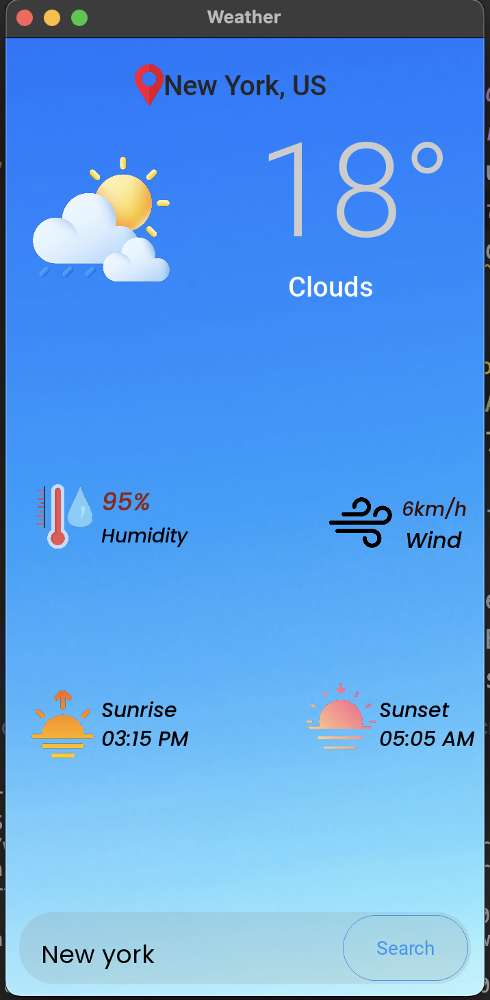
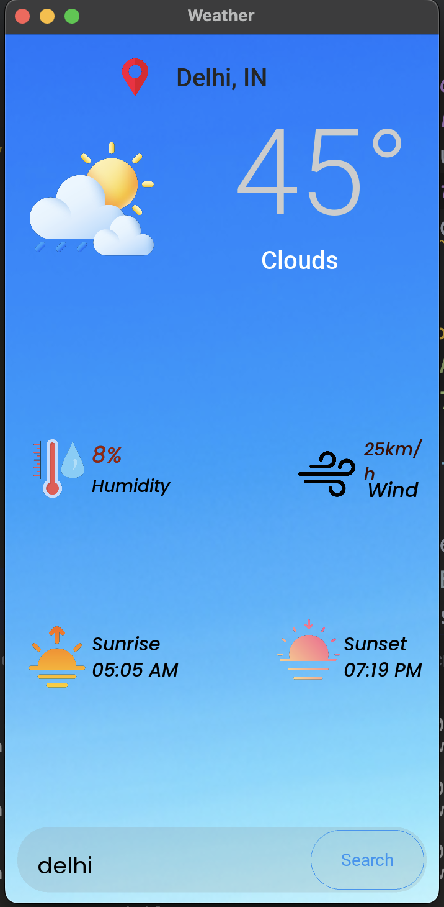
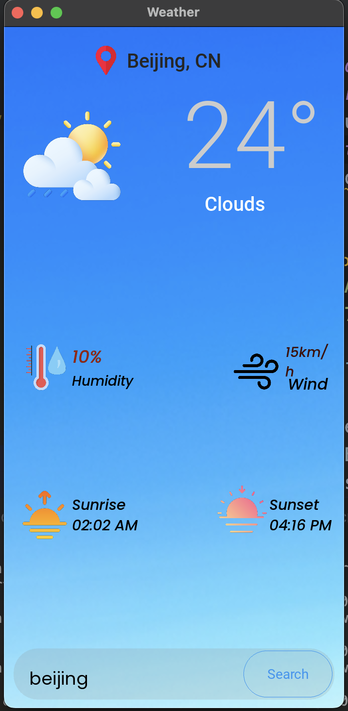
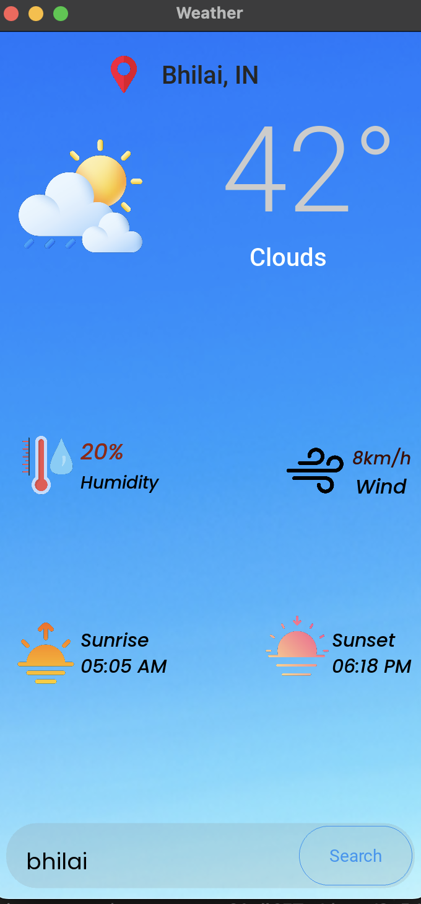

# ⛅️ Weather App 🌦️


> **A beautiful, real-time weather application with a modern UI built using Python & KivyMD!**  
> **Check the weather anywhere, anytime – fast, easy, and stylish!** 🌍✨

---

## 📋 Features

- 🔄 **Real-time weather updates**  
- 🎨 **Attractive & responsive UI** powered by KivyMD  
- 🔍 **Search weather by city name**
- 🌡️ **Displays temperature, humidity, wind speed, and weather conditions**
- 🛡️ **Error handling** for invalid cities or network issues

---

## 🛠️ Tech Stack

| Tool/Library           | Purpose                                       | Emoji  |
|------------------------|-----------------------------------------------|--------|
| Python 3.x             | Core programming language                     | 🐍     |
| Kivy                   | Core GUI framework                            | 📱     |
| KivyMD                 | Material Design UI components                 | 🎨     |
| OpenWeather API        | Fetches live weather data                     | ☁️     |
| requests               | API calls                                     | 🔗     |
| datetime               | Time & date formatting                        | 🕒     |
| BeautifulSoup          | Parsing HTML/XML (for extra features)         | 🍜     |

---

## 🖼️ Samples

<details>
  <summary>Click to preview screenshots!</summary>

  
  
  
  

</details>

---

## ⚙️ Prerequisites

> **You’ll need Python installed!**  
>  
> **To get started, install the required libraries:**

```bash
pip install kivy kivymd requests beautifulsoup4
```

---

## 🚀 Get Started

1. **Clone the repository:**
   ```bash
   git clone https://github.com/PatelG108/Weather-app.git
   cd Weather-app
   ```
2. **Run the app:**
   ```bash
   python main.py
   ```

---

## 👤 Author

- **Amit Kumar**
- [](https://www.linkedin.com/in/amit-kumar-c/)

---

## 🌟 Contribute & Feedback

> ⭐ Star this repo if you like it!  

---